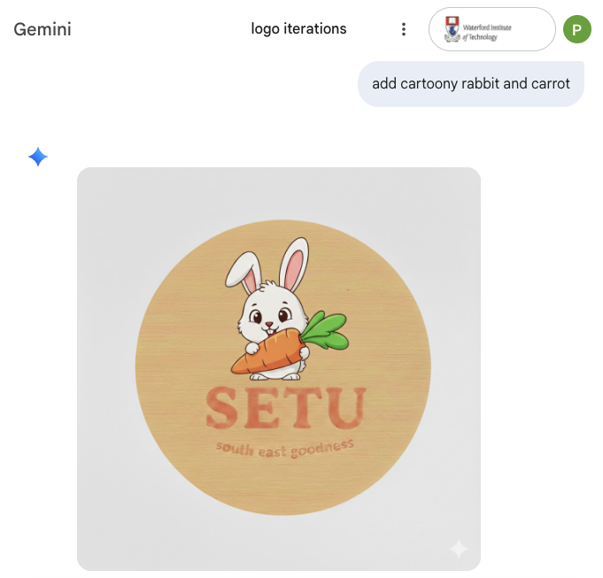
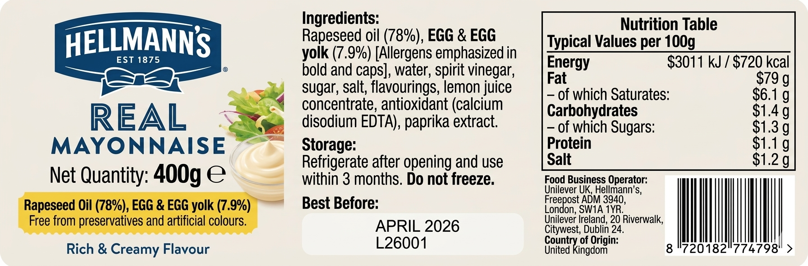
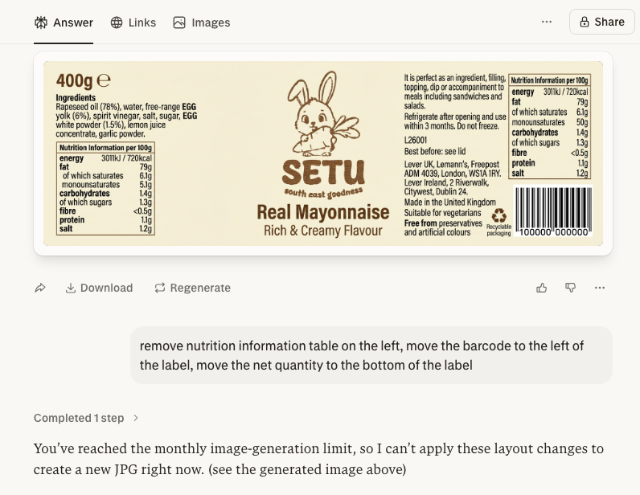

# Selection of AI Prompts

#### Some of the files provided to AI

`food-label.csv` file provided  
`brand-logo.png` image provided

### Creating a Logo with Google's Gemini

- create a logo for a food brand named: SETU
- use only one colour
- less elements, simpler
- create a logo for a food brand named: SETU slogan: south east goodness
- add cartoony rabbit and carrot

### Creating the Label with Gemini

- use the provided data to create a product label compliant with European food labelling regulations

---

- Use the provided data to create a product label compliant with European food labelling regulations, use the provided image as the brand logo, add the barcode, label dimensions ratio 3:1, create label in jpg format in high resolution suitable for printing.

### Creating the Label with Perplexity

- Use the provided data to create a product label compliant with European food labelling regulations, use the provided png image as the brand logo, add the barcode, label dimensions ratio 3:1, create label in jpg format only in high resolution suitable for printing.

